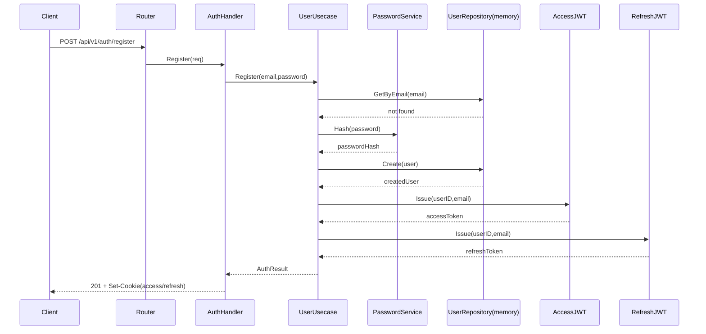
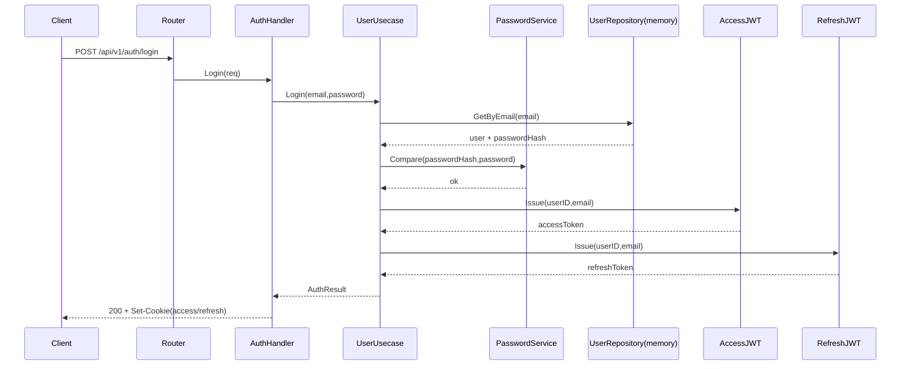
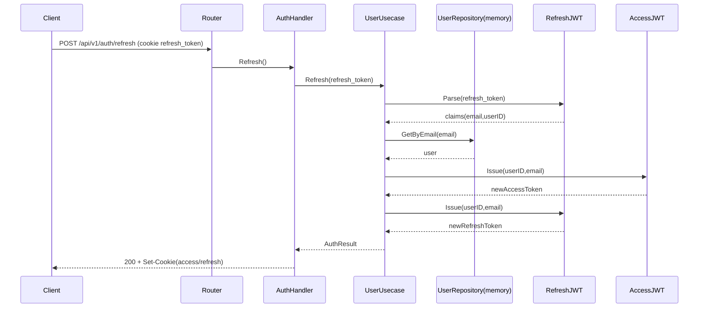
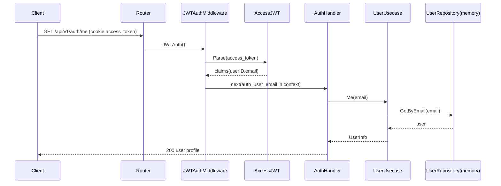
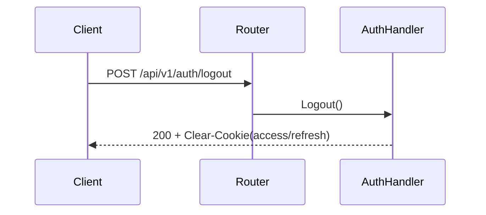

# Auth Sequence Diagrams

เอกสารนี้สรุปลำดับการทำงานของระบบ Auth แบบ REST ใน my-storage-service ด้วย Mermaid

## 1) Register

## 2) Login

## 3) Refresh Token

## 4) Me (Protected Endpoint)

## 5) Logout

